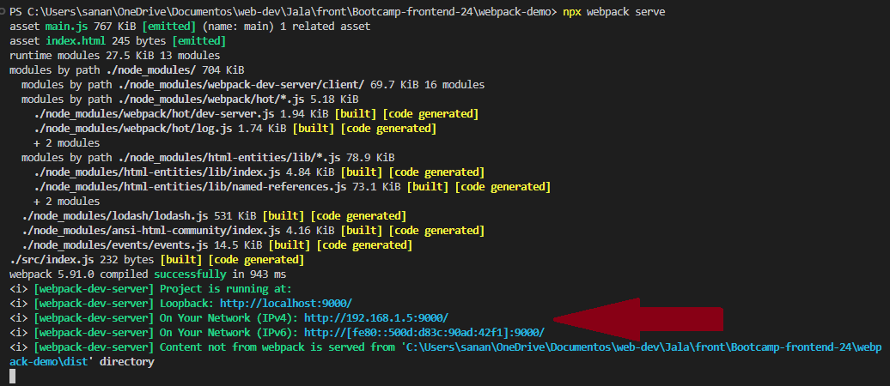
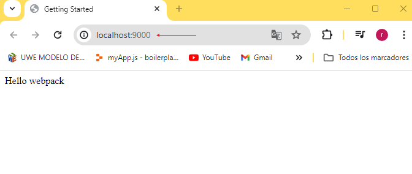
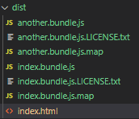

# CHALLENGE
## Research about flag mode: Dev, Prod, Common

### Mode Dev (development)

- Focused on compilation speed and ease of debugging
- No extensive optimizations are performed
- Source maps are included for easy debugging
- Warning and error messages may be included

### Mode Prod (production)

- Significant optimization in code, dead code removal minification
- Output is optimized for loading speed and production efficiency
- Source maps are usually disabled to reduce the size of the final packet
- Shorter file names are generated and comments are removed

### Mode Common (none o common)

- This mode disables any default settings provided by webpack
- Useful mode to set manually without any default optimization

# Configure dev, prod, common mode, and create npm scripts for dev and prod mode
```json
"scripts": {
  "build:dev": "webpack --mode development",
  "build:prod": "webpack --mode production",
  "build:custom": "webpack --mode none"
}
```


# HTML-WEBPACK-PLUGIN
- It is a tool used to automate the creation and configuration of the html files needed for a project, automatically integrating the JS files generated by Webpack
- This is especially useful for webpack bundles that include a hash in the filename which changes every compilation. 

- Some advantages of using this are:
    - Time savings: Automate the inclusion of scripts and other assets in the HTML.
    - Error reduction: Minimizes the possibility of human error by manually including script paths.
    - Configurability: Allows you to customize the final HTML in various ways.

# SOURCE MAPS
- Source Maps are files that help link minified (generated) code with its original version (source code)
- These allow designers and developers to identify and fix code errors, increasing productivity and development time.
- With source maps, when an error occurs in the browser, you can see exactly which line of the original code the problem occurred, instead of just seeing the minified code, which can be difficult to understand.
- The main advantages of using source maps are Easy debugging and beter readability of the code

# DEV SERVER
- Webpack-dev-server can be used to quickly develop an application
- Acts as a development server serving your application
- Features:
  - Hot module replacement, dev server allows the modules to update in real time without refreshing the whole page. This is very useful because you can see the changes you make in a module inmediately
  - Live Reloading, Dev server detects when there are changes in files and reloads the whole page
  - Serve static files
  - Proxying, Allows you to configure proxies to redirect requests to other servers.
  - It can be easily configured within the webpack configuration file, allowing you to customize the server according to the needs of the project.

- As an example, web server is implement in the current project, you can see the console, this project is beeing served in the port 9000

  

- This is a web navigator where you can see that the current project is beeing served in the port 90000

  

# Mod DEV - PROD - COMMON

- Webpack Documentation recommends to separate webpack configurations for each environment
- While we will separate the production and development we'll still maintain a "common" configuration to keep things DRY (don't repeat yourself). 
- In order to merge these configurations together, we'll use a utility called webpack-merge. 
- With the "common" configuration in place, we won't have to duplicate code within the environment-specific configurations.

```js
// webpack common
const path = require('path');
const HtmlWebpackPlugin = require('html-webpack-plugin');

module.exports = {
  entry: {
    app: './src/index.js',
  },    
  devServer: {
    static: {
	    directory: path.join(__dirname, 'dist'),
	},
    compress: true,
    port: 9000,
    hot: true,
    },
  plugins: [
    new HtmlWebpackPlugin({
        template: './index.html',
        filename: 'index.html',
        minify: {
            collapseWhitespace: true,
        }
    }),
  ],
  output: {
    filename: '[name].bundle.js',
    path: path.resolve(__dirname, 'dist'),
    clean: true,
  },
};
```

```js
//webpack dev
const { merge } = require('webpack-merge');
const common = require('./webpack.common.js');

module.exports = merge(common, {
  mode: 'development',
  devtool: 'inline-source-map',
  devServer: {
    static: './dist',
  },
});
```

```js
// webpack prod
const { merge } = require('webpack-merge');
const common = require('./webpack.common.js');

module.exports = merge(common, {
  mode: 'production',
  devtool: 'source-map'
});
```

# Code Splitting
- Code splitting is one of the most compelling features of webpack
- This feature allows you to split your code into various bundles which can then be loaded on demand or in parallel.
- Benefits:
  - Faster loading: Only the code necessary for the initial view of the application is loaded.
  - Better performance: By reducing the initial file size, download time is shorter
  - Network optimization: Users do not have to download all application code in a single request
- There are three general approaches to code splitting available:

  - Entry Points: Manually split code using entry configuration.
  - Prevent Duplication: Use Entry dependencies or SplitChunksPlugin to dedupe and split chunks.
  - Dynamic Imports: Split code via inline function calls within modules.

## Entry Points
- The easiest and most intuitive way to split code

```js
  entry: {
    index: './src/index.js',
    another: './src/another-module.js',
  },
```


