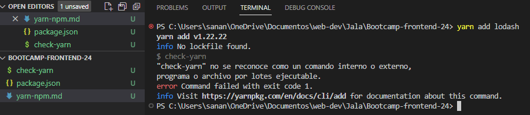
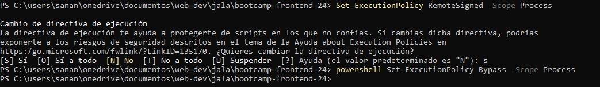
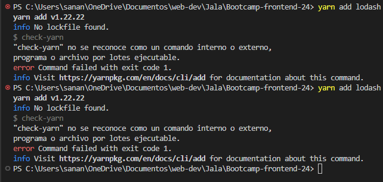

# Prevent new developers use "yarn install" on the project

To prevent the use of "yarn" in a project where it was established that only "npm" would be used, we can use "pre-scripts".

## What is a "pre-script"?
They are scripts that are executed before a main command. For example, if we have a "pre-build" script, it will be executed before the "npm build".

## 1st way to configurate prescipt
In the package.json

```json
{
  "name": "bootcamp-frontend-24",
  "version": "1.0.0",
  "description": "",
  "main": "index.js",
  "scripts": {
    "preinstall": "check-yarn",
    "check-yarn": "if which yarn; then echo 'Yarn is not allowed on this project, use NPM'; exit 1; fi"
  },
  "keywords": [],
  "author": "",
  "license": "ISC"
}

```
## 2nd way to configurate prescript
In an independent file, with the name of "check yarn"
```
#!/bin/bash
if which yarn; then
  echo 'Yarn is not allowed on this project, use NPM'
  exit 1
fi
```

### Demo - Personal experience
I tried to prove if it works, I installed yarn succesfully, then I try to install a package with yarn and see if the prescript is working well, but I couldn't, this is the message I have in console



I search for information about this problem and I found that mi pc does not allow to run unknown scripts, that's why I tried to change this configuration with powershell



Then I retried to run "yarn add lodash" to see if my prescripts works well, but again I have the same problem



### Conclusion

I will continue searching information to fix this problem. However, although the prescript does not work in the correct way, it was possible to prevent packages from being installed with yarn

# Fixing bug ✔️✔️✔️✔️✔️

Using directly the script "check yarn" in the "preinstall" script works succesfully
```
{
  "name": "bootcamp-frontend-24",
  "version": "1.0.0",
  "description": "",
  "main": "index.js",
  "scripts": {
    "preinstall": "if which yarn; then echo 'Yarn is not allowed on this project, use NPM'; exit 1; fi"
  },
  "keywords": [],
  "author": "",
  "license": "ISC"
}
```
